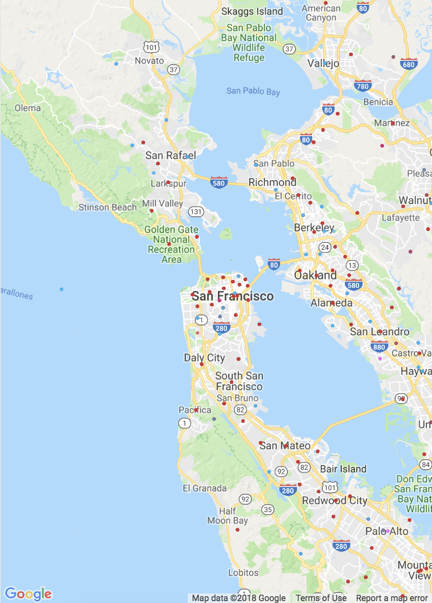

# Google Maps Scatterplot Overlay

I wanted to play with some location data and plot over Google Maps

What you need:
- Packages listed in the Jupyter Notebook
- Location data (long & lat)
- Google Maps api key

I generated some fake order data which looks like this:

| longitude     | latitude           | user_id  |   food_ordered    |
| ------------- |:-------------:| -----:| -----:|
| -121.8306     |	39.901000   | user_123 | Pizza |
| -123.1210     | 38.551697      |   user_54353 | Sushi |
| -121.4501     | 49.247498	      |    user_3908 | Ramen |

